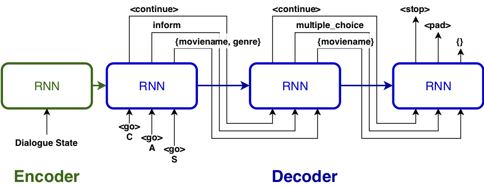
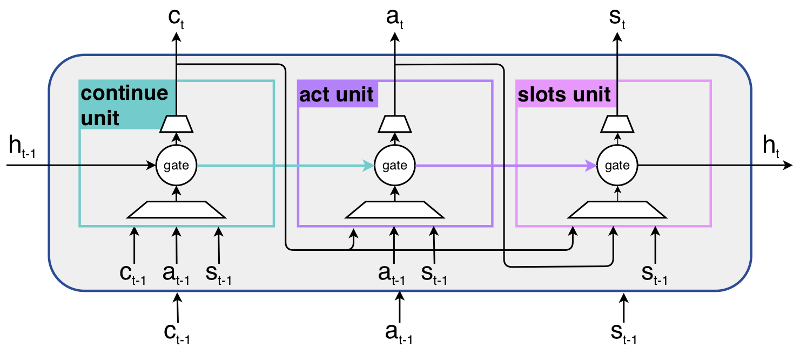

# Modeling Multi-Action Policy for Task-Oriented Dialogues

Code for our EMNLP 2019 paper "[Modeling Multi-Action Policy for Task-Oriented Dialogues](https://arxiv.org/abs/1908.11546)".

## Problem to Solve
In most existing approaches, the agent predicts only one DM policy action per turn.
This significantly limits the expressive power of the conversational agent and introduces unwanted turns of interactions that may challenge users' patience.

We propose a novel policy model based on a recurrent cell called gated Continue-Act-Slots (gCAS). It outputs multiple actions per turn (called multi-act) by generating a sequence of tuples and expanding agents' expressive power.



The gated CAS cell contains three sequentially connected units for outputting continue, act, and slots respectively.



## Environment
The code is tested on macOS 10.14.6 with Python 2.7.15(Anaconda), PyTorch 1.2.0, cPickle.
We suggest make an anaconda environment for all packages.

### We use the data from [Microsoft Dialogue Challenge](https://github.com/xiul-msr/e2e_dialog_challenge)
It contains three domains: movie, restaurant, and taxi with dialog act annotated. We use their dialogue management code and knowledge base to obtain the state.
The processed data are placed under `data/` folder.
If you use the data, please also cite [Xiujun Li's papers](https://github.com/xiul-msr/e2e_dialog_challenge).


### training
```
python model.py -domain movie -network gcas -mode train #(default) train on cpu
python model.py -domain movie -network gcas -mode train -cfg cuda=True #train on gpu
```
if you want to train all domains, please consider to use the bash script `bash train_all.sh`

### testing
For the movie domain,
```
python model.py -domain movie -network gcas -mode test
```
For all domains, `bash test_all.sh`

## Citation
If you find this work useful, please cite as following.
```
```